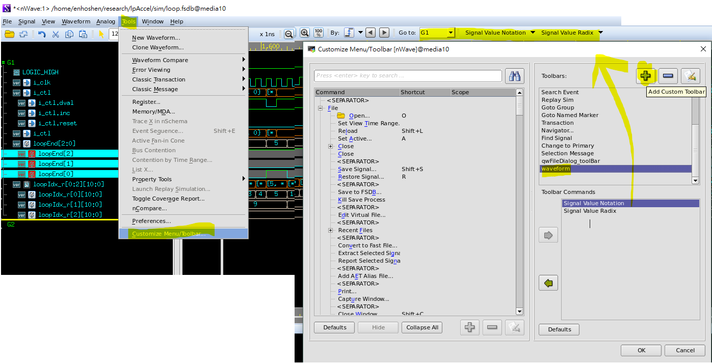

# Notes for simulation using ncverilog and nicotb


## nicotb
### createbuses
* bus of 1D array signal shape should be tailed with a comma `,`...\
see the signal `t` from the following code:

tb.py:
```python
cbbus, abus = CreateBuses([             
        (                               
                (""  , "c", (2,4)),     
                (None, "b", (3,2,4)),   
                (None, "t", (2,)),      
        ),                              
        ("a",),                         
])                                      
```
tb.sv
```verilog                               
logic clk, rst;                
logic [3:0] a;                 
logic [10:0] b [3][2][4];      
logic [10:0] c [2][4];         
logic [3:0] t [2] ;            
```
* just like before, initialize your signal, or get as many `x` and `z` as you can
```verilog
def clk_cb():                
        cbbus.SetToX()       
        //cbbus[0].x[1,1] = 0  don't use x ! it is 4-valued encoding of x
        //cbbus[2].x = 0       
        cbbus[0].value[1,1]= 0
        cbbus[2].value[0] = 0
        yield rst_out        
        while True:          
            yield clk        
            abus.Read()      
```
* self defined packed struct signal can be directly controlled by its name
```verilog
structbus, abus = CreateBuses([
        (  
              ("", "mytype.member1", ),
              (None, "mytype.member2", ),
        ),
        ("a",),
])
```
* 1 bit signal dimension should not be of `(1,)`, instead a empty tuple `tuple()`
```python
bitbus1 = CreateBus( ("" , "bitSignal" )
bitbus2 = CreateBus( ("" , "bitSignal2" , tuple() )
bitbus3 = CreateBus( ("" , "bitSignal3" , () )
```

## nWave
* If you have any self defined type, struct,`$fsdbDumpvars()` arguments should be `"+all"`..................
```verilog
inital begin
    $fsdbDumpfile("tb.fsdb");
    $fsdbDumpvars("+all"); // rather than something like $fsdbDumpvars(0,tb,'+mda');
end
```
* You can configure toolbar, making constantly used function more easily accessible.

  save the configuration in `.conf` format, and open your nWave with the command:
```shell
$nWave  -guiConf mynWave.conf &
```
## Makefile
* See for the [GNU make documentation](http://www.gnu.org/software/make/manual/make.html#Goals) for elaborated information
* Automatic variables : `%` `<` `@` 
* I encounter this problem where `$@` becomes `Makefile` rather than the target input from command line if the Makefile looks like this:
    ```Makefile
    %: if($(SV),$(SV).sv,%.sv)
    TEST=if($(TEST),$(TEST),%@)\
    TOPMODULE=if($(TOPMODULE),$(TOPMODULE),%@)\
    ...\
    ```
    so whenever the file `$(SV).sv` changed ( it's a prerequisite, makefile checks it), variables `TEST` and `TOPMODULE` get flushed to "Makefile".
I can fix this by update the Makefile to the drive, but I remove the prerequisite list so far so I don't have to bother with this issue. Note that
`%` target is related to ``pattern rules``, find out more for the section.
## MISC
* I came across this issue where I create a file named `struct.py`, which appears to be a built-in file(?) for 
python to read, resulting constant compile error within this file even if I were just testing stuff using the python console!  
**Careful naming excluding any built-in names is a must, be more specific**, for example this file has something to do with systemverilog,
so I should have used name like `SVstruct.py` or so.

