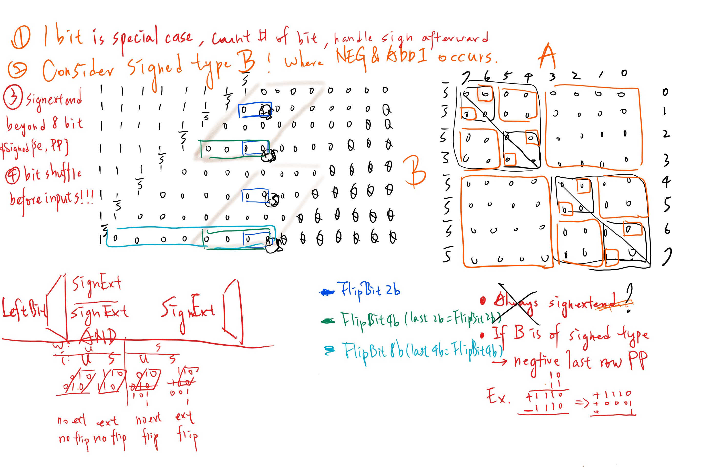

# The implementation notes for PE related modules
## Verilog syntax
* Indexing using brackets `[]` followed a variable inside parentheses is not allowed
* Use localparam inside for loop in a generate block for some temporary local parameter (not for logics, signals)
```verilog
(7-x)[0] //not allowed, right parentheses expected error
```
If the variable is of logic type, define a logic to hold it together.
However I encounter this situation where I need to indexing a bit out a genvar inside the for loop of a generate block
```verilog
genvar j;
generate begin
    for ( j =0 ; j<8 ; ++j )begin
        if( (j-7)[0] ) //error
        //some code//
```
I found this solution where you put localparam inside for loop to create a temporary parameter for `j-7`, 
actually I also learned from this that genvar, integer used in verilog for loop are like localparam for each iteration, 
expand the for loop code with  for loop index of each iteration defined as a localparam works exactly the same.
```verilog
genvar j;
generate begin
    for ( j=0 ; j<8 ; ++j )begin
        localparm j7 = j-7;
        if( j7[0] ) // no complains finally
        //some code//
```
## Architecture notes

